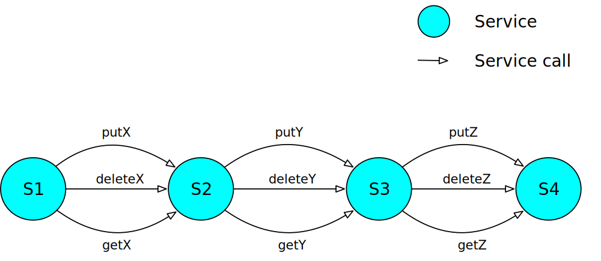
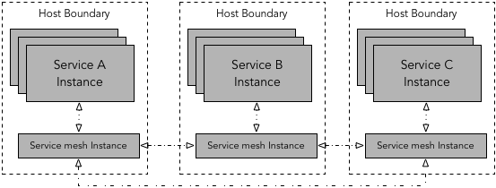

# Nam pretium feugiat consequat

Ut auctor quam quis erat placerat, id vestibulum ex tempor. Curabitur congue, ligula non faucibus rhoncus, purus nunc luctus nunc, id fringilla neque urna ac turpis. Integer fermentum vehicula dui vel tincidunt. Suspendisse potenti. Proin aliquam, tortor ac efficitur mattis, nibh metus ultrices metus, eu tempor risus enim suscipit nisi. Quisque imperdiet eu nisi sed eleifend. Integer maximus leo eu velit volutpat mollis sit amet ut arcu. Sed id aliquam sapien. Donec bibendum velit quis elit tempus, et condimentum augue scelerisque.

## Nam posuere ipsum ut

Nisl pharetra vestibulum. Fusce venenatis vulputate felis ac facilisis. Aenean cursus sed nulla non porta. Donec vestibulum sem purus, sit amet iaculis dolor dapibus sed. Mauris ut mattis leo, ac convallis ipsum. Duis facilisis facilisis cursus. Curabitur semper, magna ut scelerisque tincidunt, turpis orci commodo dolor, ac posuere ante quam in sapienas 8th time lucky as do.



Suspendisse congue ante in velit finibus laoreet. Pellentesque non mattis ipsum. Maecenas in est pharetra, maximus odio et, laoreet mi. Mauris nec sem ut massa semper tristique. Integer sit amet tortor vitae ante consequat eleifend at vitae urna. Fusce quis sodales ipsum. Duis non porttitor erat. Curabitur auctor quis nunc vitae dictum. Etiam maximus augue in ante pretium finibus. Orci varius natoque penatibus et magnis dis parturient montes, nascetur ridiculus mus. Nulla imperdiet elit libero, id laoreet tellus lacinia in. Donec a leo ac urna placerat sagittis et eu risus. Vivamus tincidunt ante ut lacus pharetra elementum. Praesent eu commodo enim. Pellentesque porttitor auctor imperdiet.



In lobortis consequat nibh, nec fringilla diam varius nec. In consectetur erat eu mi porttitor, eu consectetur velit tincidunt. Mauris ac vehicula lorem, vitae dapibus lectus. Pellentesque habitant morbi tristique senectus et netus et malesuada fames ac turpis egestas. Integer sit amet massa quis diam consectetur rhoncus. Praesent pulvinar, justo quis commodo aliquet, metus purus lobortis ante, ac auctor ante enim ac turpis. Vivamus ut finibus lorem. Ut eget purus rutrum, ullamcorper ante eget, congue massa. Nullam sed justo vitae urna sollicitudin facilisis do test run.

+---------------------+-----------------------+
| Location            | Temperature 1961-1990 |
|                     | in degree Celsius     |
|                     +-------+-------+-------+
|                     | min   | mean  | max   |
+=====================+=======+=======+=======+
| Antarctica          | -89.2 | N/A   | 19.8  |
+---------------------+-------+-------+-------+
| Earth               | -89.2 | 14    | 56.7  |
+---------------------+-------+-------+-------+

Table:  Demonstration of simple table syntax.

# Mauris quis lacus

Fusce ultricies ante sit amet dui egestas, vitae posuere libero facilisis [@tiwari2007workflow]. Aliquam tincidunt, odio et mattis finibus, leo ante vehicula ligula, ac accumsan nunc diam ut mi. Donec ullamcorper tempus auctor. Nunc varius aliquet lectus, id consectetur diam vulputate a. Maecenas suscipit lacus sed lorem fermentum venenatis. Integer eleifend non justo egestas egestas. Ut ut vehicula metus. Proin pulvinar bibendum finibus. Etiam ac vulputate lacus, ac sagittis magna. Etiam pharetra tempus magna, a mollis neque scelerisque nec. Mauris id tortor sollicitudin diam scelerisque suscipit. Ut tincidunt purus sed est aliquam, ut sodales libero ultricies. Etiam sodales tortor quis blandit elementum [@tiwari2017Jun23]. Vestibulum tincidunt placerat arcu vel congue. Sed sodales iaculis arcu accumsan euismod.


## Algorithm 1
Just a sample algorithmn
\begin{algorithm}[H]
\DontPrintSemicolon
\SetAlgoLined
\KwResult{Write here the result}
\SetKwInOut{Input}{Input}\SetKwInOut{Output}{Output}
\Input{Write here the input}
\Output{Write here the output}
\BlankLine
\While{While condition}{
    instructions\;
    \eIf{condition}{
        instructions1\;
        instructions2\;
    }{
        instructions3\;
    }
}
\caption{While loop with If/Else condition}
\end{algorithm} 

Maecenas cursus, turpis non ultrices tristique, nisi nibh venenatis felis, vitae condimentum lacus dolor non ligula. Aliquam vel imperdiet ligula. Quisque eget luctus sem. Morbi ultrices elit mi. Suspendisse ante diam, vulputate a consectetur id, viverra vitae lacus. Duis mattis turpis eget magna sollicitudin, a hendrerit tortor sagittis. Proin scelerisque sollicitudin ex, vitae convallis tellus suscipit quis. Aenean dictum pellentesque libero, ut pharetra est pulvinar a. Nam sit amet nisi dignissim, molestie ligula a, laoreet erat. Nulla sit amet placerat turpis, condimentum pellentesque magna. Fusce sodales sollicitudin lorem, sed sollicitudin nulla vulputate eu. Donec tempus id augue imperdiet iaculis. Etiam iaculis enim sit amet tellus convallis, id mollis neque porttitor. Donec vel euismod neque, et pretium massa. Mauris ornare enim vitae quam aliquam, ut tristique orci convallis.

```plantuml
Alice -> Bob: Authentication Request
Bob --> Alice: Authentication Response

Alice -> Bob: Another authentication Request
Alice <-- Bob: another authentication Response
```

Proin porttitor [feugiat orci vitae](#whatever1) condimentum. Duis in dui aliquet, faucibus odio et, egestas nulla. Proin non tristique quam, eu pulvinar ante. Nunc id lorem interdum, mattis arcu sed, dignissim ex. Nullam fringilla rutrum mi, sit amet tincidunt neque lacinia sit amet. Nullam felis ante, faucibus commodo malesuda ac, lacinia ut erat. Mauris purus dui, eleifend quis lacus non, pulvinar mollis felis. Nam elit nisi, facilisis vel nisl sit amet, aliquet viverra est. In sodales tristique sapien [vitae condimentum](#whatever2). Mauris condimentum sapien sit amet lacus consequat dictum. Aliquam vestibulum ut augue eget laoreet. Sed sed massa justo.

```{.graphviz #whatever1 caption="this is graph using neato engine"}
graph G {
	fontname="Helvetica,Arial,sans-serif"
	node [fontname="Helvetica,Arial,sans-serif"]
	edge [fontname="Helvetica,Arial,sans-serif"]
	layout=neato
	run -- intr;
	intr -- runbl;
	runbl -- run;
	run -- kernel;
	kernel -- zombie;
	kernel -- sleep;
	kernel -- runmem;
	sleep -- swap;
	swap -- runswap;
	runswap -- new;
	runswap -- runmem;
	new -- runmem;
	sleep -- runmem;
}
```

Suspendisse aliquet nisi lacinia fermentum pretiuwm. Donec et condimentum ipsum, quis gravida ligula. Aliquam placerat massa eu ipsum viverra tincidunt. Maecenas pretium mauris quis tempor euismod. Maecenas imperdiet lorem sit amet varius consectetur. Nullam bibendum diam nec placerat sodales. Aenean molestie facilisis pharetra.

```{.graphviz #whatever2 caption="this is graph using dot engine" layout="dot" directed=True}
digraph finite_state_machine {
	fontname="Helvetica,Arial,sans-serif"
	node [fontname="Helvetica,Arial,sans-serif"]
	edge [fontname="Helvetica,Arial,sans-serif"]
	rankdir=LR;
	node [shape = doublecircle]; 0 3 4 8;
	node [shape = circle];
	0 -> 2 [label = "SS(B)"];
	0 -> 1 [label = "SS(S)"];
	1 -> 3 [label = "S($end)"];
	2 -> 6 [label = "SS(b)"];
	2 -> 5 [label = "SS(a)"];
	2 -> 4 [label = "S(A)"];
	5 -> 7 [label = "S(b)"];
	5 -> 5 [label = "S(a)"];
	6 -> 6 [label = "S(b)"];
	6 -> 5 [label = "S(a)"];
	7 -> 8 [label = "S(b)"];
	7 -> 5 [label = "S(a)"];
	8 -> 6 [label = "S(b)"];
	8 -> 5 [label = "S(a)"];
}
```

##  Sed sagittis tortor
Sed rhoncus odio (see below) vitae velit sagittis, at consectetur felis venenatis. Proin feugiat eros at ultrices pellentesque. Quisque at diam ultricies, consequat ante non, auctor sapien. Nunc vel pulvinar risus. Aenean rutrum massa lacus, vel suscipit dui porta in. Etiam commodo, nunc a consequat finibus, arcu erat fringilla est, id sodales magna dui sit amet ligula. Aenean ligula nisl, lacinia sed quam vitae, vulputate eleifend nulla. Cras pellentesque nibh sit amet nulla luctus, vitae posuere velit lobortis. Integer id efficitur sapien. Vestibulum ac fringilla risus.


\usetikzlibrary{automata, positioning, arrows, calc}
\tikzset{
	->,  % makes the edges directed
	>=stealth, % makes the arrow heads bold
	shorten >=2pt, shorten <=2pt, % shorten the arrow
	node distance=3cm, % specifies the minimum distance between two nodes. Change if n
	every state/.style={draw=blue!55,very thick,fill=blue!20}, % sets the properties for each ’state’ n
	initial text=$ $, % sets the text that appears on the start arrow
 }
\begin{figure}
\centering
\begin{tikzpicture}
		\node[state with output, initial] (s0) {$S_0$ \nodepart{lower} $0$};
		\node[state with output, right of=s0] (s1) {$S_1$ \nodepart{lower} $0$};
		\node[state with output, right of=s1] (s2) {$S_2$ \nodepart{lower} $0$};
		\node[state with output, right of=s2] (s3) {$S_3$ \nodepart{lower} $0$};
		\node[state with output, right of=s3] (s4) {$S_4$ \nodepart{lower} $0$};
		\node[state with output, accepting, right of=s4] (s5) {$S_5$ \nodepart{lower} $1$};
		
		\draw (s0) edge[loop above] node{$0$} (s0)
			  (s0) edge[bend left] node[above]{$1$} (s1)
			  %
			  (s1) edge[bend left] node[above]{$0$} (s2)
			  (s1) edge[bend left] node[above]{$1$} (s0)
			  %
			  (s2) edge[bend left] node[above]{$0$} (s3)
			  (s2) edge[bend left=40] node[above]{$1$} (s0)
			  %
			  (s3) edge[bend left=50] node[above]{$0$} (s0)
			  (s3) edge[bend left] node[above]{$1$} (s4)
			  %
			  (s4) edge[bend left] node[above]{$0$} (s5)
			  (s4) edge[bend left=60] node[above]{$1$} (s0)
			  %
			  (s5) edge[bend right=40] node[above]{$1$} (s1)
			  (s5) edge[bend left=70] node[above]{$0$} (s0)
		;
\end{tikzpicture}
\caption{Moore Finite State Machine}
\end{figure}

Sed a congue eros. Morbi pulvinar commodo lacinia. Vestibulum ante ipsum primis in faucibus orci luctus et ultrices posuere cubilia curae; Praesent vulputate pulvinar sollicitudin. Praesent ac vestibulum nisl. Praesent ac felis augue. Aliquam quis enim condimentum, sodales diam eu, fringilla felis. Phasellus vestibulum odio mauris, at tempus ante mollis quis.


## Praesent eget orci turpis

Integer urna velit, facilisis et auctor in, consequat in dui. Duis neque risus, dignissim eget nibh bibendum, sagittis rhoncus odio. Fusce a ante at tortor porttitor feugiat ac at tortor. Duis maximus laoreet lorem, eu feugiat velit tristique sit amet. Maecenas suscipit ante vel nulla condimentum, sit amet faucibus lectus aliquet. Aenean in aliquet ipsum. Fusce nisl orci, rutrum suscipit porta eu, euismod malesuada purus. Sed mollis bibendum massa sit amet venenatis.
```
#include <stdio.h>
int main() {
   // printf() displays the string inside quotation
   printf("Hello, World!");
   return 0;
}
```

# Conclusion

Pellentesque in justo quis sem commodo luctus et quis odio. Curabitur cursus faucibus tristique. Aliquam erat volutpat. Vestibulum quis orci dapibus, auctor ligula vitae, commodo dui. Phasellus id tincidunt urna, consequat maximus massa. Vestibulum ante ipsum primis in faucibus orci luctus et ultrices posuere cubilia curae; Nullam elementum sit amet est id convallis. Vivamus ante ante, placerat id fermentum ut, suscipit sed neque. Nunc scelerisque nisl turpis, in aliquam velit ultrices in. Fusce libero lorem, rutrum nec semper at, posuere ac nulla. Integer pellentesque tincidunt elit vel ultrices. Integer tempus, sem bibendum eleifend tempor, est ligula pharetra metus, quis tristique urna eros ut nibh. Suspendisse dui nibh, vehicula eu pretium at, ultrices scelerisque augue.


# References